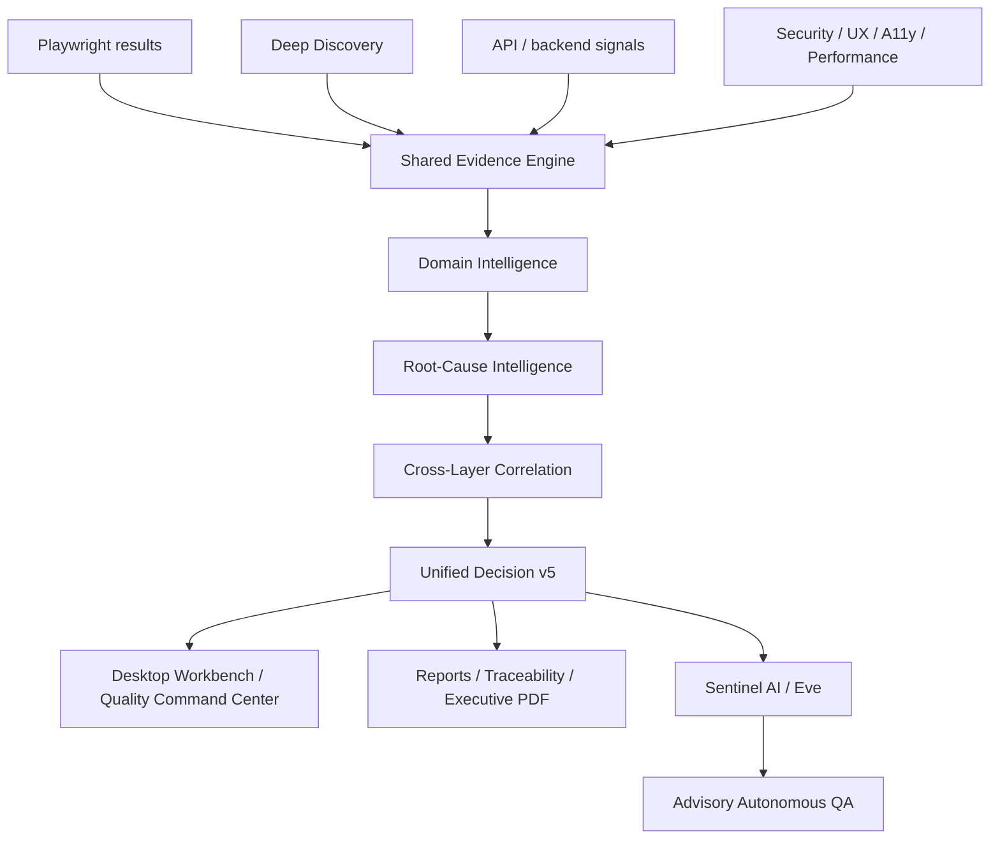

<p align="center">
  
</p>

<h1 align="center">QA Sentinel Tyra Enterprise</h1>

<p align="center">
  <strong>Evidence-Driven Quality Intelligence Ecosystem</strong><br/>
  Playwright execution, Deep Discovery, Unified Decisioning, Security Intelligence, Sentinel AI, live dashboards and executive reporting.
</p>

<p align="center">
  
  
  
  
  
  
  
  
  
  
  
  
  
  
  
</p>

---

## What is QA Sentinel Tyra?

QA Sentinel Tyra is an **evidence-driven Quality Intelligence ecosystem** for modern web applications.

Playwright remains a core execution engine, but Sentinel is designed to go beyond test execution. It combines test outcomes, Deep Discovery, authenticated-session evidence, runtime and network signals, accessibility, UX/UI, security, performance, API/backend evidence and cross-layer correlation into one explainable quality model.

### Accessible dashboard display

The dashboard includes local, presentation-only accessibility preferences for
larger text, high contrast, red-green and blue-yellow colour support,
monochrome display, reduced motion and emphasized links. A keyboard skip link,
visible focus treatment and polite live regions improve navigation with
assistive technology. Preferences are stored in the browser and do not modify
test results, scoring, release readiness or autonomous QA decisions.

The monitored sites continue to use the existing axe-core, colour-contrast,
ARIA, keyboard-focus and keyboard-trap checks for accessibility evidence.

### Windows launcher and desktop workbench

QA Sentinel Tyra now includes a dedicated **desktop Workbench** built around the current Tyra visual identity. Build it with `npm run build:exe` and launch `dist/QA-Sentinel-Tyra.exe`.

Normal EXE startup opens the Workbench **without automatically starting a Full QA run**. Testing begins only when the operator chooses an action inside the application. Automatic Full QA at startup is opt-in with `--auto-test`.

The Workbench provides:

- Dashboard overview with current metrics, recent runs and system status
- Release Status pipeline: **Build → Tests → Analysis → Report → Release Decision**
- explicit run target selection: **Both sites / Nation only / AI Skills only**
- **Run Full QA**, **Fast Chromium** and guarded **Security Modes**
- report navigation without the old long stacked-panel layout
- Playwright report **on demand only**
- a dedicated global **Accessibility** main-menu entry
- **English as the default UI language**, with Swedish, Simplified Chinese, Hindi, Spanish, Arabic (RTL) and French available in Settings
- selectable visual themes: **Tyra Azure, Emerald, Amethyst, Amber, Rose and Arctic**
- persisted local language, theme and accessibility preferences

The Windows build uses a failsafe packaging step: the custom Tyra icon is applied with `resedit --no-grow`, the resulting EXE is smoke-checked with `--check`, and the build falls back to the verified RAW executable if post-processing is unsafe.

See `docs/WINDOWS-EXE-LAUNCHER.md` for build/setup details and `docs/PENTEST-SECURITY.md` for the authorized security modes.

Instead of stopping at **passed** or **failed**, QA Sentinel Tyra adds:

- requirements and functionality intelligence
- critical-flow coverage and impact analysis
- UX/UI, accessibility, security, performance and compatibility intelligence
- API and backend intelligence with positive first-party verification evidence
- Deep Discovery and automatic route exploration
- authenticated session and protected-route verification
- runtime, network and security signal analysis
- root-cause fingerprinting and issue deduplication
- P0–P4 prioritization and severity guardrails
- cross-layer correlation
- Unified Decisioning for canonical schema-v5 release assessment
- evidence-aware release-scope protection
- advisory risk-based test selection and execution planning
- advisory failure reproduction and verification planning
- advisory change-impact, quality-drift and investigation planning
- Sentinel AI / Eve as an evidence-grounded intelligence layer
- live dashboard, HTML, Markdown, traceability and executive PDF reporting

The goal is simple:

**Quality First. Automate Everything. Ship with Confidence.**

The core trust rule is:

> **Sentinel must never claim more than the available evidence supports.**

That means **NOT VERIFIED is not PASSED**, a partial run cannot publish a full release decision, and a security observation is not automatically a vulnerability.

Automation remains deliberately advisory: QA Sentinel Tyra can propose what to inspect or verify, but it does not authorize production remediation, silently execute release-changing actions or override Unified Decisioning autonomously.
---

## QA Sentinel Tyra Ecosystem

QA Sentinel Tyra is being developed as a modular ecosystem rather than a collection of isolated test utilities.

```text
                    QA SENTINEL TYRA
                           │
                  QUALITY COMMAND CENTER
                           │
     ┌─────────────────────┼─────────────────────┐
     │                     │                     │
 Discovery            Functional QA        Security
     │                     │                     │
 Accessibility          UX / UI            Performance
     │                     │                     │
 API / Backend       Compatibility       Requirements
     └─────────────────────┼─────────────────────┘
                           │
                    EVIDENCE ENGINE
                           │
                 Root-Cause Intelligence
                           │
                 Cross-Layer Correlation
                           │
                  Unified Decisioning
                           │
       ┌───────────────────┼───────────────────┐
       │                   │                   │
   Dashboard            Reports        Sentinel AI / Eve
                                               │
                                    Advisory Autonomous QA
```

Every intelligence module should answer, whenever evidence permits:

```text
What was verified?
What evidence was observed?
What does the evidence support?
How confident is Sentinel?
What should happen next?
```

New modules should feed the same evidence, provenance, confidence and Unified Decisioning architecture instead of creating competing truth models.

### Core ecosystem principles

- **Evidence before conclusions**
- **NOT VERIFIED is not PASSED**
- partial verification does not equal full release verification
- warnings do not automatically become blockers
- security observations do not automatically become vulnerabilities
- correlation does not automatically prove causation
- AI analysis must remain traceable to evidence
- autonomous recommendations do not become execution authority
- production-changing actions remain human-controlled

---

## Current capabilities

| Capability | Status |
|---|---|
| Playwright test integration and custom QA reporter | ✅ |
| Live dashboard with automatic refresh | ✅ |
| HTML and Markdown reports | ✅ |
| Historical run data | ✅ |
| Multi-site Deep Discovery and route crawling | ✅ |
| Runtime, network and security/CSP signal analysis | ✅ |
| Discovery noise filtering | ✅ |
| Root-cause fingerprinting and deduplication | ✅ |
| Cross-browser and cross-profile issue consolidation | ✅ |
| P0–P4 prioritization and severity guardrails | ✅ |
| Requirements & Functionality Intelligence | ✅ M5.2 |
| Critical Flows Intelligence | ✅ M5.3 |
| UX/UI Intelligence | ✅ M5.4 |
| Security & Performance Intelligence | ✅ M5.5 |
| Compatibility Intelligence | ✅ M5.6 |
| API & Backend Intelligence | ✅ M5.7 |
| Cross-layer Correlation | ✅ M5.8 |
| Unified Scoring & Decisioning | ✅ M5.9 |
| Canonical schema-v5 release authority | ✅ |
| Advisory Autonomous QA foundation | ✅ M6.1 |
| Risk-based logical-test selection | ✅ M6.2 |
| Advisory execution planning | ✅ M6.3 |
| Advisory failure reproduction | ✅ M6.4 |
| Advisory verification planning | ✅ M6.5 |
| Advisory change-impact analysis | ✅ M6.6 |
| Advisory pairwise quality-drift comparison | ✅ M6.7 |
| Advisory investigation planning | ✅ M6.8 |
| Sentinel AI live dashboard binding | ✅ Post-M6 |
| Positive first-party API/backend verification evidence | ✅ Post-M6 |
| Full configured compatibility-matrix verification | ✅ Post-M6 |
| Authenticated Google SSO session coverage | ✅ Nation + AI Skills |
| Dynamic generated-route coverage | ✅ 13 Nation + 13 AI Skills routes in current scanner inventory |
| Partial-run release integrity guard | ✅ Targeted/partial runs resolve release readiness to `not-verified` |
| Pass rate vs Quality Health semantics | ✅ Project pass rate and weighted Quality Health are presented separately |
| Autonomous test execution | 🔒 Disabled by policy (`QA_AUTONOMOUS_EXECUTION`) |
| Local remediation and release-advice artifacts | ✅ `reports/remediation.md`, `reports/release-update.md` / status artifacts — production writes stay off |
| Captcha clicking | ✅ First-party cookie/consent + native checkboxes; iframe reCAPTCHA/hCaptcha queued unless `SENTINEL_CAPTCHA_SOLVER_KEY` |
| LLM enrichment | 🔒 Off without `SENTINEL_LLM_API_KEY` / `OPENAI_API_KEY` — heuristic Sentinel AI still runs |
| AI-assisted root-cause intelligence | ✅ Heuristic always; LLM opt-in fail-open |
| Unified dashboard intelligence | ✅ Control Center + quality dashboard |
| Discovery-aware release readiness | ✅ Discovery JSON wired into M7.3 counters |
| Milestone 7 — Unified Dashboard Intelligence & Operationalization | ✅ Complete |
| PDF executive reports | ✅ `reports/executive-report.pdf` after each run |
| GitHub Actions integration | ✅ Typecheck + unit required; PR comment; scheduled/`workflow_dispatch` `qa:sites` may flake; optional dispatch 18-matrix + Lighthouse |
| GitHub Pages sample dashboard | ✅ Workflow ready; Petter must enable Pages (Actions source) |
| History retention | ✅ `history.json` keeps the last 50 runs (`QA_HISTORY_LIMIT` override) |
| Requirements traceability | ✅ `reports/traceability.html` after each reporter run; `npm run report:traceability` |
| Multi-project dashboard | ✅ Nation + AI Skills in `config/projects.json` |
| Security execution modes | ✅ M8 foundation: Production Safe / Staging Active / Manual Validation |
| Production-safe security assessment | ✅ Dependency audit, headers, TLS/certificates; optional authorized ZAP Baseline |
| Active staging security assessment | ✅ Guarded: allowlisted non-production targets + explicit double opt-in |
| Manual security validation | ✅ No-network checklist/report workflow |
| Pentest dashboard + evidence reports | ✅ HTML/JSON/Markdown; intentionally isolated from Unified Decisioning |
| Windows EXE / desktop launcher | ✅ Workbench startup, on-demand QA, failsafe EXE post-processing and Tyra icon pipeline |
| Dedicated desktop QA Workbench v5.3.1 | ✅ Delivered 2026-09-16 |
| Workbench target selection | ✅ Both sites / Nation only / AI Skills only |
| Workbench Release Status pipeline | ✅ Build / Tests / Analysis / Report / Release Decision |
| Workbench language support | ✅ English default + Swedish / Simplified Chinese / Hindi / Spanish / Arabic RTL / French |
| Workbench colour themes | ✅ Tyra Azure / Emerald / Amethyst / Amber / Rose / Arctic |
| Global Workbench accessibility view | ✅ Dedicated main-menu entry with persisted display preferences |

---

## Latest verified QA snapshots

QA Sentinel Tyra keeps **development validation**, **test evidence** and **release authority** separate. A component can be validated without claiming that the live applications have a fresh full release-scope QA decision.

### Latest development validation — 2026-09-16

The newest verified evidence is for the Security Modes v6 / Windows launcher changes:

| Metric | Verified result |
|---|---|
| Local validation tests | **140 passed** |
| Security modes | `production-safe`, `staging-active`, `manual-validation` |
| Production Safe | Dependency audit, HTTP/security headers, TLS/certificate checks; optional authorized ZAP Baseline |
| Staging Active | ZAP Full Scan only for allowlisted non-production staging targets |
| Staging authorization | `QA_PENTEST_AUTHORIZED=true` + `QA_PENTEST_ACTIVE=true` required |
| Manual Validation | No network requests |
| Pentest release authority | **Isolated from Unified Decisioning** |
| Windows EXE | Rebuilt and verified |
| Playwright launch duplication | Fixed — duplicate report opening removed |

This validation does **not** replace a fresh full-scope `qa:unattended` release run. It proves the changed security/launcher code passed its local validation boundary.

### Desktop Workbench delivery — 2026-09-16

The desktop Workbench was implemented and manually exercised as the primary operator interface. This is a **launcher/UI validation**, not a replacement for a fresh full release-scope web QA run.

| Capability | Delivered behavior |
|---|---|
| Default EXE startup | Opens Workbench only; no automatic Full QA |
| Explicit auto-run | `--auto-test` starts Full QA intentionally |
| Run targeting | Both sites / Nation only / AI Skills only |
| Release Status | Build → Tests → Analysis → Report → Release Decision |
| Playwright report | Starts/opens only on operator request |
| Accessibility | Dedicated top-level Workbench view |
| Languages | English default plus six additional UI languages; Arabic supports RTL |
| Themes | Six selectable, persisted colour themes |
| Desktop packaging | RAW `pkg` build + failsafe icon post-processing + `--check` verification |

The Workbench preserves Sentinel's evidence rules: scoped runs must not be presented as full release verification, and security/pentest evidence remains isolated from Unified Decisioning until its canonical integration is explicitly validated.

### Historical Chromium prototype snapshot — 2026-08-25

| Metric | Verified result |
|---|---|
| Discovered tests | 151 |
| Passed / failed | 146 / 5 |
| Skipped / flaky | 0 / 0 |
| Weighted Quality Health | 99% |
| Release scope | Partial / unscoped |
| Release readiness | **RELEASE NOT VERIFIED** |
| Release confidence | 72% |
| Product findings | 1 |
| Content findings | 1 |
| Accessibility findings | 1 |
| Security findings | 2 |
| Automation issues | 0 |

The five retained failures in that dated snapshot were:

1. Nation homepage button without a discernible accessible name.
2. Nation theme toggle without a verified visible/stored theme-state change.
3. Nation homepage duplicated/malformed copy.
4. AI Skills catalog response missing `Content-Security-Policy`.
5. AI Skills sign-in response missing `Content-Security-Policy`.

That snapshot intentionally did **not** claim a full release decision because the run was not explicitly marked with the full release scope. A separate targeted seven-test authenticated AI Skills run also correctly reported `RELEASE NOT VERIFIED`.

### Historical full compatibility-matrix snapshot — 2026-08-17

| Metric | Verified result |
|---|---|
| Total tests | 175 |
| Passed / failed | 152 / 23 |
| Overall health | 96% |
| Release readiness | Ready with warnings |
| Release risk / confidence | Medium / 88% |
| API intelligence | Healthy — 22 positively verified endpoints |
| Backend intelligence | Healthy — 2 positively verified services |
| Positive API/backend evidence | 47 sanitized first-party records |
| API/backend release gaps | 0 |
| Compatibility release gaps | 0 |
| Remaining verification gaps | UX/UI, security and performance |

Positive API/backend evidence is **verified first-party response metadata**, not a vulnerability count. Dated validation snapshots are evidence records, not permanent guarantees of current application health.

---

## Architecture



Raw Playwright outcomes, Deep Discovery findings, authenticated-session evidence and first-party application signals retain their source identity while being normalized into a shared evidence model.

Requirements, critical flows, UX/UI, accessibility, security/performance, compatibility, API/backend and cross-layer analyzers contribute to **Unified Decisioning**.

Unified Decisioning remains the canonical release authority for dashboard schema v5. The legacy release assessment is retained only as comparison telemetry.

The Advisory Autonomous QA layer may create candidates, plans, reproduction recipes, comparisons and hypotheses, but it has no autonomous production-remediation or release-decision authority.

Successful same-origin `document`, `fetch` and `xhr` responses can contribute sanitized positive API/backend verification evidence. Response bodies, credentials, query strings and URL fragments are not retained. Zero findings without positive evidence remains `not-verified`.

The roadmap extends this architecture with:

- **M8 — Security Weakness Intelligence (IN PROGRESS; security modes delivered)**
- **M9 — Sentinel Ecosystem Intelligence**
- **M10 — Platform & Enterprise Evolution**
---

## Quick start

Default workflow: **Ubuntu on WSL** + **VS Code** (Remote - WSL). Windows
PowerShell is not the intended shell.

### Windows desktop Workbench

Build and launch the desktop application:

```powershell
npm install
npm run build:exe
.\dist\QA-Sentinel-Tyra.exe
```

A normal launch opens the Workbench and waits for operator input. It does **not** automatically start Full QA. To intentionally start Full QA immediately:

```powershell
.\dist\QA-Sentinel-Tyra.exe --auto-test
```

Inside the Workbench, choose **Both sites**, **Nation only** or **AI Skills only**, then start Full QA or Fast Chromium from the UI.

### Ubuntu / WSL and VS Code

1. Install [Ubuntu from Microsoft Store](https://apps.microsoft.com/detail/9pdxgncfsczv) and [VS Code](https://code.visualstudio.com/).
2. In VS Code install **Remote - WSL** and **Playwright Test for VS Code** (also listed in `.vscode/extensions.json`).
3. `Ctrl+Shift+P` → **WSL: Connect to WSL** → open this folder:

```bash
cd qa-sentinel-tyra
```

4. Copy env placeholders (no real secrets in git):

```bash
cp .env.example .env
```

Fill only what you have. Never commit `.env`.

```bash
# .env (you fill)
NATION_TEST_EMAIL=
NATION_TEST_PASSWORD=
AI_SKILLS_TEST_EMAIL=
AI_SKILLS_TEST_PASSWORD=
OPENAI_API_KEY=
SENTINEL_CAPTCHA_SOLVER_KEY=
```

`NATION_TEST_*` / `AI_SKILLS_TEST_*` unlock member routes. `OPENAI_API_KEY`
(or `SENTINEL_LLM_API_KEY` in `.env.example`) is optional LLM enrichment.
`SENTINEL_CAPTCHA_SOLVER_KEY` is the optional paid iframe solver. Leave blanks
to skip those paths; tests skip instead of inventing passwords.

5. Install and typecheck:

```bash
npm install
npx playwright install chromium firefox webkit
npm run typecheck
npm run test:unit
```

GitHub Actions on push/PR is typecheck + unit (required). Pull requests get a
short unit-test comment plus a link to the workflow artifacts. Nightly and
**workflow_dispatch** run `qa:sites` (Chromium, both sites) with artifacts;
`qa:unattended` is local/full. Optional **Run workflow** checkboxes:

- `run_full_matrix` — 18-project `qa:matrix` (120 min, continue-on-error)
- `run_lighthouse` — `npm run qa:lighthouse` (not on every PR)

GitHub Pages sample dashboard: enable **Settings → Pages → Source: GitHub
Actions**, then run **Deploy GitHub Pages dashboard**. See
[`docs/GITHUB-PAGES.md`](docs/GITHUB-PAGES.md). Branch protection for `main`
is a repo-admin UI step: [`docs/BRANCH-PROTECTION.md`](docs/BRANCH-PROTECTION.md).

VS Code tasks: **Terminal → Run Task…** → `typecheck`, `test:unit`, `qa:unattended`, `qa:sites`, `qa:matrix`, `dashboard`.

### The command to run (both sites)

`test:nation:ci` is Nation-only and does not scan. To check **nation.dev and aiskills.nation.dev together** on Chromium only (bounded scan + daily Chromium tests, one `latest-run.json`):

```bash
cd qa-sentinel-tyra
npm run qa:sites
```

That is the **fast Chromium alias**. Firefox, Safari, tablet and mobile stay **not in this run**.

For **everything measured on all browsers and devices**:

```bash
cd qa-sentinel-tyra
npx playwright install chromium firefox webkit
npm run qa:unattended
```

`qa:unattended` then:

1. Scans both sites with `QA_MAX_PAGES` default **20** (the live apps have ~12–13 public routes each).
2. Runs hand-written tests across Chromium, Firefox and WebKit × desktop, tablet and mobile (18 projects).
3. Keeps generated discovered-page smoke, Deep Discovery crawl and diagnostics on daily Chromium only.
4. Writes one dashboard run covering both sites, all analyzers, and the human-review pack.

`qa:sites` now also measures document security headers (CSP / HSTS / X-Content-Type-Options / clickjacking) and anonymous Set-Cookie flags on both homepages and sign-in, plus axe-core smoke on the Nation homepage and Skills catalog, plus page-load / first-party API timing on the Nation homepage, Nation sign-in, and Skills catalog. Missing headers fail honestly. No cookies or no first-party XHR/fetch is recorded as not-observed, not poor. Settings in the dashboard is a read-only catalog view, not an editor.

Then:

```bash
npm run dashboard
```

Open `http://127.0.0.1:4173/`.

### Unattended run + human review pack

The daily command that measures **everything** (scan + full 18-project matrix + all analyzers + human-review pack) is:

```bash
git pull && npm i && npx playwright install chromium firefox webkit && npm run qa:unattended
```

That is slower than Chromium-only. It:

1. Bounded-scans both sites (`QA_MAX_PAGES` default 20).
2. Runs hand-written tests across **both sites × Chromium / Firefox / WebKit × desktop / tablet / mobile** (18 Playwright projects).
3. Keeps generated discovery smoke, Deep Discovery crawl and diagnostics on daily Chromium only so they are not multiplied by 18.
4. Runs every reporter analyzer onEnd and writes the human-review pack.

No prompts and no production writes. First-party cookie/consent banners are dismissed unattended. Google reCAPTCHA/hCaptcha iframes are queued for a human unless `SENTINEL_CAPTCHA_SOLVER_KEY` is set (their sites only, default off). Heuristic Sentinel AI always runs. LLM stays **LLM off — no key** unless `SENTINEL_LLM_API_KEY` or `OPENAI_API_KEY` is set. After `onEnd` the reporter writes local `reports/remediation.md` and `reports/release-update.md` (not a product deploy).

`qa:sites` is the fast Chromium-only alias. `qa:matrix` is the 18-project matrix **without** a fresh scan.

If `.env` contains `NATION_TEST_EMAIL`/`PASSWORD` and/or `AI_SKILLS_TEST_*`, the run logs in once, writes `playwright/.auth/*.json` (`storageState`), and hits member routes (`/home`, `/jobs`, `/profile`, `/assessment`). If those variables are missing, the tests skip and the pack lists **one** human item: *Add test account to unlock /home /jobs /profile /assessment*.

After the run, open:

```text
reports/human-review.html
```

or, with the dashboard up, `http://127.0.0.1:4173/reports/human-review.html`.

The short executive PDF is written by the same `onEnd` hook:

```bash
ls -l reports/executive-report.pdf
xdg-open reports/executive-report.pdf
```

The pack is the manual-work minimizer:

- **30-second verdict** — GO / WARN / NO-GO and three bullets why
- **Do not touch** — already classified product bugs, content bugs, header failures, serious a11y (theme-toggle and duplicated-skills stay here as developer work)
- **Needs a human (max ~7)** — only gaps that still need judgment or credentials, with screenshot/trace/video links
- **Untested routes** — crawled by discovery but no hand-written E2E

CSP analytics stays a warning, not a human fire drill. Failed traces use Playwright `retain-on-failure` (plus video on fail).

Daily Ubuntu loop (everything: scan + all browsers and devices):

```bash
git pull && npm i && npx playwright install chromium firefox webkit && npm run qa:unattended && npm run dashboard
```

Fast Chromium-only (Firefox/Safari/tablet/mobile stay not-in-this-run):

```bash
npm run qa:sites
```

`qa:matrix` is 2 sites × Chromium / Firefox / WebKit (Safari) × Desktop / Tablet / Mobile = **18 Playwright projects** without a new scan. Microsoft Edge is not a separate project; Chromium covers the Edge Blink engine. `qa:browsers` and `qa:compat` are aliases of `qa:matrix`. No `NATION_TEST_*` credentials are required.

### Advisory, local remediation, captcha, LLM

These run in the reporter `onEnd` of `npm run qa:unattended` (full matrix, not removed):

| Area | Default | Env |
|---|---|---|
| Autonomous QA advisory | On — investigation plans and risk-based task selection from latest-run (theme, copy, untested routes, missing auth) | always |
| Local remediation + release update | On — `reports/remediation.md`, `reports/release-update.md`, `reports/release-status.json` | `QA_AUTONOMOUS_REMEDIATION=1` (set `0` to skip files) |
| GitHub issues on `Peppe2236/qa-sentinel-tyra` | Off | `QA_CREATE_ISSUES=1` and `GH_TOKEN` or `GITHUB_TOKEN` |
| First-party cookie/consent click | On (`nation.dev`, `aiskills.nation.dev` only) | always |
| Iframe captcha solver | Off — detect, screenshot, one human-queue item | `SENTINEL_CAPTCHA_SOLVER_KEY` (optional 2captcha/capsolver) |
| LLM pack enrichment | Off — dashboard shows **LLM off — no key** | `SENTINEL_LLM_API_KEY` or `OPENAI_API_KEY` |

Production writes against nation.dev stay off. Release updates are human-review artifacts, not deploys.

Browsers and form factors that did not execute in a run are **not in this run**, not poor. After `qa:sites`, Chrome/Chromium and Desktop are measured; Firefox, Safari, Tablet, and Mobile stay not in this run until you run `qa:unattended`. After `qa:unattended`, Chrome, Firefox, Safari and Desktop, Tablet, Mobile cards show measured pass/fail.

Nation-only or Skills-only (still scans first):

```bash
npm run qa:nation
npm run qa:skills
```

Line endings are LF (`.gitattributes` + `.vscode/settings.json`). If an old file is still CRLF:

```bash
git add --renormalize .
```

### 1. Clone the repository

```bash
git clone https://github.com/Peppe2236/qa-sentinel-tyra.git
cd qa-sentinel-tyra
```

### 2. Install dependencies

```bash
npm install
```

### 3. Install Playwright browsers

```bash
npx playwright install
```

### 4. Type-check the project

```bash
npm run typecheck
```

### 5. Run both sites (preferred: everything)

```bash
npx playwright install chromium firefox webkit
npm run qa:unattended
```

This bounded-scans nation.dev and aiskills.nation.dev, then runs the full 18-project browser × device matrix into one dashboard run. Do not use `npm run test:nation:ci` if you want Skills coverage or Deep Discovery inventory — that script is Nation tests only and skips the scan.

Fast Chromium-only:

```bash
npm run qa:sites
```

Matrix without a fresh scan:

```bash
npm run qa:matrix
```

### Security / pentest modes

Security assessment is intentionally separated from normal QA execution:

```bash
# Production Safe — authorized, non-destructive
QA_PENTEST_AUTHORIZED=true npm run qa:pentest:production

# Production Safe + optional ZAP Baseline
QA_PENTEST_AUTHORIZED=true QA_PENTEST_ZAP=true npm run qa:pentest:production

# Staging Active — only allowlisted non-production targets
QA_PENTEST_AUTHORIZED=true QA_PENTEST_ACTIVE=true npm run qa:pentest:staging

# Manual Validation — no network requests
npm run qa:pentest:manual
```

Staging targets are constrained by `config/pentest.json`. Pentest evidence is reported separately and does not silently update Unified Decisioning or release readiness. See [`docs/PENTEST-SECURITY.md`](docs/PENTEST-SECURITY.md).

### 6. Start the QA dashboard

```bash
npm run dashboard
```

Then open:

```text
http://127.0.0.1:4173/
```

---

## Deep Discovery

Deep Discovery allows QA Sentinel Tyra to explore configured applications independently of traditional assertion-based Playwright test cases.

The current discovery engine supports:

- multiple configured sites
- automatic route crawling
- route normalization
- runtime console signal collection
- network failure detection
- sanitized positive first-party `document`, `fetch` and `xhr` evidence
- security and Content Security Policy signals
- expected browser-event filtering
- telemetry noise filtering
- root-cause fingerprinting
- duplicate consolidation
- occurrence counting
- affected-route tracking
- priority scoring
- critical-route intelligence

The current implementation supports discovery across both:

```text
nation.dev
aiskills.nation.dev
```

Discovery reports are generated separately for each configured site.

Example:

```text
reports/discovery/nation.json
reports/discovery/ai-skills.json
```

---

## Positive API and backend verification evidence

Deep Discovery now retains safe metadata for successful first-party application responses:

```text
document → backend-service evidence
fetch/xhr → api-endpoint evidence
```

Only same-origin responses with successful HTTP status are eligible. Stored URLs are sanitized by removing credentials, query strings and fragments, and no response body is retained.

Assessment semantics remain conservative:

- positive evidence with no matching issue can establish `healthy`
- positive evidence plus findings produces the appropriate degraded risk state
- zero findings plus zero evidence remains `not-verified`
- third-party activity cannot establish first-party health

The verified 2026-08-17 full-matrix run produced 22 API endpoint records and two backend services with zero API/backend release gaps.

---

## Discovery signal filtering

Modern web applications generate browser activity that does not automatically represent a product defect.

QA Sentinel Tyra therefore filters and reclassifies signals such as:

- expected aborted browser requests
- framework navigation activity
- Next.js / RSC request behaviour
- media requests aborted by navigation
- analytics requests affected by CSP
- telemetry resources affected by CSP

The goal is not to hide failures.

The goal is to distinguish **actionable application problems** from **expected browser and framework noise**.

---

## Root-cause intelligence

Deep Discovery does not treat every repeated browser event as a separate defect.

Related findings are consolidated using fingerprints.

A consolidated finding can retain:

```text
fingerprint
occurrences
affectedRoutes
priorityScore
priority
```

For example:

```text
39 observations
9 affected routes
1 root-cause finding
```

This prevents the dashboard from presenting dozens of duplicate issues when the same underlying problem occurs repeatedly across an application.

---

## Priority intelligence

Discovery findings use a P0–P4 priority model:

| Priority | Meaning |
|---|---|
| P0 | Critical / immediate action |
| P1 | High priority |
| P2 | Significant issue |
| P3 | Lower priority / review |
| P4 | Informational |

Priority intelligence uses two related concepts:

### Priority score

`priorityScore` represents the strength and scope of a discovery signal.

The score can consider:

- severity
- issue category
- number of affected routes
- critical application routes

### Actionable priority

`priority` represents the final P0–P4 classification.

Severity guardrails prevent scope alone from incorrectly escalating low-severity findings into release-level priorities.

For example, a low-severity issue may have:

```text
priorityScore: 76
priority: P3
```

The higher score communicates that the issue is widespread or affects important routes, while the P3 guardrail preserves the fact that the underlying signal is still low severity.

This separates **signal strength** from **action urgency**.

---

## Scope intelligence

QA Sentinel Tyra distinguishes between:

```text
occurrences
```

and:

```text
affectedRoutes
```

`occurrences` measures how many times a signal was observed.

`affectedRoutes` measures how widely the underlying problem is distributed across the application.

This distinction prevents repeated events on a single route from receiving the same significance as a root cause affecting many independent user flows.

---

## Critical-route intelligence

Not every application route has equal business or user impact.

Deep Discovery can apply additional weight when findings affect important user flows such as:

```text
/signin
/signup
/profile
/assessment
/path
/skills
/practice
```

Other routes may receive a smaller importance weight.

Critical-route weighting is deliberately bounded and combined with severity guardrails so that route importance cannot independently turn a low-severity observation into a critical release blocker.

---

## Unified Issue Queue

QA Sentinel Tyra consolidates source-aware findings into a unified quality model:

```text
Playwright test issues
Deep Discovery findings
API and backend issues
            ↓
    Unified Issue Queue
            ↓
Cross-layer correlation
            ↓
   Unified Decision v5
```

The unified queue is written to:

```text
dashboard/data/unified-issues.json
```

Each finding retains provenance such as source identity, test links, requirement links, critical-flow links and affected scope. This lets later analyzers correlate evidence without treating every source as the same kind of failure.

The queue now feeds the completed Milestone 5 quality-intelligence framework and the advisory Milestone 6 workflow. It is no longer only a foundation for a future dashboard or release model.

---

## Cross-browser and profile intelligence

QA Sentinel Tyra now separates the browser engine from the execution profile.

Browser families are normalized into:

```text
Chromium
Firefox
WebKit
```

Execution profiles are tracked independently:

```text
Desktop
Tablet
Mobile
```

Desktop uses Playwright desktop devices at 1280×720. Tablet uses iPad Pro 11. Mobile uses Pixel 5 (Chromium/Firefox) and iPhone 12 (Safari/WebKit). This prevents device profiles from being treated as browser families.

The reporting model now provides both a **Browser Matrix** (Chrome / Firefox / Safari) and a **Profile Matrix** (Desktop / Tablet / Mobile). Safari is Playwright WebKit. Chromium covers Microsoft Edge; there is no dedicated `msedge` project.

### Cross-browser actionable issue deduplication

A single underlying defect can fail across several Playwright projects, browsers and profiles. QA Sentinel Tyra consolidates those repeated failures into actionable issues instead of presenting every failed execution as a separate defect.

Consolidated test issues can retain:

```text
fingerprint
occurrences
affectedProjects
affectedBrowsers
affectedProfiles
affectedSites
sourceTestIds
rootCause
confidence
recommendation
userImpact
```

This preserves the full impact scope while keeping one root cause as one actionable issue. Release assessment can therefore reason about consolidated issues instead of artificially inflating issue counts because the same defect reproduced in multiple environments.

---

## Reports

Every completed run can produce multiple views of the same canonical quality data.

### Live dashboard

The live dashboard exposes:

- Unified Decision release readiness and evidence state
- **Human review pack** (Control Center card + optional “Needs human” issue filter)
- **Executive PDF** (`reports/executive-report.pdf`)
- live Sentinel AI summary, per-test root-cause notes (theme, copy, headers), impact, recommendation and next action
- positive API/backend and compatibility evidence state
- quality, health and pass/fail metrics
- product, content and automation findings
- quality-dimension assessments
- browser, profile and performance intelligence
- prioritized and unified issue views
- historical run data
- advisory Autonomous QA assessment

### Dashboard data

The reporter writes the current run and supporting queues to:

```text
dashboard/data/latest-run.json
dashboard/data/history.json
dashboard/data/issues.json
dashboard/data/unified-issues.json
```

`history.json` stores prior runs and is capped at the **last 50** (`QA_HISTORY_LIMIT`
to override). Milestone 6.7 uses the latest previous canonical schema-v5 run as a pairwise comparison baseline. If no valid baseline exists, the result is `no-baseline`; the analyzer does not claim a multi-run trend.

### Traceability

Each Playwright run with the dashboard reporter writes:

```text
reports/traceability.html
```

That table maps `requirements/requirements.json` to latest-run evidence
(covered / partial / gap). Regenerate without a new test run:

```bash
npm run report:traceability
```

### Discovery reports

Deep Discovery produces structured site-specific reports under:

```text
reports/discovery/
```

These reports contain discovered routes, findings, consolidated root causes, prioritized findings and sanitized positive first-party API/backend evidence.

### Executive HTML report

QA Sentinel Tyra generates a styled executive report:

```text
reports/latest-report.html
reports/human-review.html
reports/executive-report.pdf
```

When the dashboard server is running:

```text
http://127.0.0.1:4173/reports/latest-report.html
http://127.0.0.1:4173/reports/human-review.html
http://127.0.0.1:4173/reports/executive-report.pdf
```

### Markdown report

A technical Markdown version is also generated:

```text
reports/latest-report.md
```

Generated runtime reports can be excluded from Git where appropriate so the repository remains clean. A tiny committed stub can be seeded with `npm run dashboard:sample`. See [`dashboard/data/sample/README.md`](dashboard/data/sample/README.md).

---

## Project structure

```text
qa-sentinel-tyra/
├── .github/workflows/
├── .vscode/
├── config/
│   ├── pentest.json
│   └── projects.json
│
├── dashboard/
│   ├── assets/
│   │   ├── qa-sentinel-tyra-workbench-header.png
│   │   ├── qa-sentinel-tyra-icon.png
│   │   └── qa-sentinel-tyra.ico
│   ├── data/
│   ├── command-center.css
│   ├── dashboard.css
│   ├── dashboard.js
│   ├── index.html
│   ├── sentinel-ai.css
│   ├── site-health.css
│   ├── workbench-i18n.mjs
│   ├── workbench-v3.css
│   ├── workbench-v3.mjs
│   ├── workbench-v52.css
│   └── workbench-v52.mjs
│
├── docs/
│   ├── BRANCH-PROTECTION.md
│   ├── GITHUB-PAGES.md
│   ├── QA-SYSTEM-BACKLOG.md
│   ├── PENTEST-SECURITY.md
│   ├── WINDOWS-EXE-LAUNCHER.md
│   └── assets/
│
├── reporters/
│   ├── analyzers/
│   ├── models/
│   ├── utils/
│   └── qa-dashboard-reporter.ts
│
├── reports/
│   └── discovery/
│
├── scripts/
│
├── tests/
│   ├── discovery/
│   ├── generated/
│   ├── helpers/
│   ├── nation/
│   ├── pages/
│   ├── skills/
│   └── unit/
│
├── utils/
├── package.json
├── playwright.config.ts
├── tsconfig.json
└── README.md
```

Planned ecosystem documentation additions:

```text
docs/
├── ECOSYSTEM-ARCHITECTURE.md
├── SECURITY-WEAKNESS-INTELLIGENCE.md
└── DEMO-INTEGRITY.md

SECURITY.md
```

The files in this second block remain roadmap targets until they are added. `docs/PENTEST-SECURITY.md` and `docs/WINDOWS-EXE-LAUNCHER.md` are current documentation and are therefore listed in the main project tree above.

---

## Release-readiness intelligence

QA Sentinel Tyra evaluates more than the raw number of failing tests. Quality-dimension assessments and cross-layer evidence feed the canonical Unified Decision model, which produces the schema-v5 release assessment.

The canonical output is identified by:

```text
schemaVersion: 5
releaseDecisionSource: 'unified-v5'
```

The legacy release assessment remains available as comparison telemetry, but it is not the canonical release authority. Cross-browser duplicates are consolidated before actionable issue counts are evaluated, preventing the same root cause from being counted repeatedly because it reproduces in several environments.

Milestone 6 can recommend investigation or verification work, but it cannot automatically change the release decision.

Post-M6 positive API/backend evidence now participates in the canonical release assessment. Missing evidence remains a verification gap, while successful current-run first-party evidence can remove that gap without hiding promoted API or backend issues.

---

## Milestone 5 — Quality Intelligence Framework

Milestone 5 was completed on **2026-08-13**.

| Delivery | Result |
|---|---|
| 5.1 Quality Intelligence Foundation | Shared evidence and assessment foundation |
| 5.2 Requirements & Functionality | Requirement and acceptance-criteria intelligence |
| 5.3 Critical Flows | Critical-flow and scenario intelligence |
| 5.4 UX/UI | User-experience and interface quality intelligence |
| 5.5 Security & Performance | Security and performance assessment |
| 5.6 Compatibility | Browser, profile and compatibility assessment |
| 5.7 API & Backend | API and backend issue intelligence |
| 5.8 Cross-layer Correlation | Correlated evidence across quality layers |
| 5.9 Unified Scoring & Decisioning | Canonical schema-v5 release authority |

Unified Decisioning reuses the established priority and evidence semantics across layers. Legacy release telemetry remains available for comparison.

---

## Milestone 6 — Advisory Autonomous QA Framework

Milestone 6 was completed on **2026-08-17**.

| Delivery | Advisory result |
|---|---|
| 6.1 Foundation | Autonomous QA assessment and advisory candidate model |
| 6.2 Risk-based Test Selection | Logical-test candidates linked to existing risk and provenance |
| 6.3 Execution Planning | Ordered advisory phases and test steps |
| 6.4 Failure Reproduction | Evidence-linked reproduction recipes for current failures |
| 6.5 Verification Planning | Plans remain `awaiting-new-evidence` until new results exist |
| 6.6 Change Impact Analysis | Potential impact is identified but never claimed as confirmed |
| 6.7 Quality Drift Comparison | Current run compared with the latest prior canonical schema-v5 run |
| 6.8 Investigation Planning | Cases and root-cause hypotheses for changed or potential-regression signals |

### Milestone 6 safety contract

- `executionEnabled` remains `false`.
- Candidate actions and plans remain advisory-only and `executable: false`.
- No Playwright tests or shell commands are launched by the analyzers.
- No remediation is authorized or applied.
- No automatic release-decision update is allowed.
- Verification requires new evidence; a plan is not proof of a pass or resolution.
- Change impact, quality drift and root cause remain explicitly unconfirmed.
- Existing Unified Decision, P0–P4 priority and evidence semantics are reused; Milestone 6 introduces no competing weighted score.

---

## Issue intelligence

Findings can be separated into categories such as:

- Product bug
- Content bug
- Automation issue
- Accessibility issue
- Performance issue
- Security issue
- Needs investigation
- Warning

This prevents every failed Playwright assertion or browser signal from automatically being treated as a production defect.

QA Sentinel Tyra is designed to preserve the difference between:

```text
test failure
product defect
automation problem
browser noise
security signal
performance signal
discovery observation
```

while still bringing actionable findings together for analysis.

---

## Security Weakness Intelligence — Milestone 8 🚧 IN PROGRESS

Milestone 8 now has a delivered **security execution and authorization foundation**, while deeper shared Evidence Engine / correlation work remains in progress.

### Delivered modes

| Mode | Purpose | Guardrail |
|---|---|---|
| Production Safe | Dependency audit, headers, TLS/certificates, optional ZAP Baseline | Explicit authorization; non-destructive production checks only |
| Staging Active | ZAP Full Scan against configured staging | `config/pentest.json` allowlist + `QA_PENTEST_AUTHORIZED=true` + `QA_PENTEST_ACTIVE=true`; production domains blocked |
| Manual Validation | OWASP-oriented auth/session/API/business-logic checklist | No network requests |

```bash
QA_PENTEST_AUTHORIZED=true npm run qa:pentest:production
QA_PENTEST_AUTHORIZED=true QA_PENTEST_ZAP=true npm run qa:pentest:production
QA_PENTEST_AUTHORIZED=true QA_PENTEST_ACTIVE=true npm run qa:pentest:staging
npm run qa:pentest:manual
```

Dedicated pentest evidence includes the Pentest dashboard and HTML/JSON/Markdown outputs such as `reports/pentest/pentest-report.html`. Pentest findings remain **isolated from Unified Decisioning** until canonical evidence/correlation semantics for release authority are explicitly implemented and validated.

### Security evidence maturity model

```text
NOT VERIFIED
    ↓
SECURITY OBSERVATION
    ↓
CONFIRMED WEAKNESS
    ↓
SUSPECTED VULNERABILITY
    ↓
CONFIRMED VULNERABILITY
```

A finding may only move to a stronger state when new evidence supports the stronger claim.

### Safety contract

- Security assessment is **non-destructive by default**.
- Ordinary QA configuration never implies authorization for intrusive testing.
- Production Safe does not permit active exploitation.
- Staging Active is restricted to allowlisted non-production staging targets.
- ZAP Full Scan requires explicit authorization plus active-mode opt-in.
- Manual Validation performs no network requests.
- A missing control may be a weakness without being a confirmed vulnerability.
- Production-changing actions remain human-controlled.

---

## Performance intelligence

The reporter currently tracks metrics including:

- wall-clock duration
- average test duration
- median duration
- P95 duration
- fastest test
- slowest test
- slowest-test ranking

This creates a foundation for future regression detection and performance budgets.

---

## Roadmap

The authoritative roadmap is maintained in [`ROADMAP.md`](ROADMAP.md).

### Milestone 5 — Quality Intelligence Framework ✅

- requirements and functionality intelligence
- critical-flow intelligence
- UX/UI, security/performance and compatibility intelligence
- API and backend intelligence
- cross-layer correlation
- Unified Decisioning as the canonical schema-v5 release authority

### Milestone 6 — Advisory Autonomous QA Framework ✅

- risk-based logical-test selection
- advisory execution and failure-reproduction planning
- verification planning that awaits new evidence
- potential change-impact analysis
- pairwise quality-drift comparison
- advisory investigation cases and unconfirmed hypotheses

### Milestone 7 — Unified Dashboard Intelligence & Operationalization ✅

Milestone 7 is defined in `ROADMAP.md`. All deliveries **7.1–7.8 are done**: site-specific npm commands, advisory dashboard, discovery-aware provenance, measured UX/security/performance evidence (nav, forms, reduced-motion, layout-shift observation, mixed content, HTTPS links, LCP/FCP), heuristic+LLM root-cause notes, and documented operationalization (`qa:unattended` locally; nightly Chromium `qa:sites` on GitHub).

Post-M7 leftovers that still need Petter (credentials or GitHub admin) are
tracked in [`docs/QA-SYSTEM-BACKLOG.md`](docs/QA-SYSTEM-BACKLOG.md). In-repo
this round: GitHub Pages **workflow**, in-CI optional 18-matrix, keyboard a11y,
Lighthouse `workflow_dispatch`, history cap, traceability HTML, PR comments,
and branch-protection **docs**. Unified Decisioning remains the release
authority and Autonomous QA remains advisory-only.

### Post-M7 — Desktop Workbench & Operator Experience ✅ DELIVERED

Delivered 2026-09-16 as a cross-cutting operational enhancement, without changing Unified Decisioning authority or Milestone 6 autonomy boundaries.

- dedicated desktop Workbench as the primary operator surface
- compact Tyra-branded desktop layout and current banner artwork
- Dashboard / Full QA / Fast Chromium / Security / Reports / Playwright / Accessibility / Settings navigation
- Both / Nation / AI Skills execution targeting
- Release Status pipeline and current-run state presentation
- on-demand Playwright report opening
- English default plus six additional UI languages and Arabic RTL
- six persisted visual themes
- dedicated global accessibility surface
- normal EXE startup does not run QA automatically; `--auto-test` is explicit opt-in
- failsafe Windows packaging with verified RAW fallback

### Milestone 8 — Security Weakness Intelligence 🚧 IN PROGRESS

- ✅ separate Production Safe, Staging Active and Manual Validation modes
- ✅ authorization-gated, non-destructive production HTTP/TLS assessment
- ✅ optional ZAP Baseline and allowlisted non-production ZAP Full Scan boundaries
- ✅ dedicated Pentest dashboard and HTML/JSON/Markdown reporting
- 🚧 evidence maturity/correlation across cookie/session, auth/access-control, CORS, API and abuse-resistance domains
- 🚧 Security Posture, historical comparison and canonical shared-evidence integration
- 🔒 pentest evidence remains isolated from Unified Decisioning until explicitly validated

### Milestone 9 — Sentinel Ecosystem Intelligence 🧭 PLANNED

- Central Evidence Engine
- standardized domain adapters
- shared provenance, confidence and evidence semantics
- ecosystem-wide correlation
- coverage-closure intelligence
- historical/regression intelligence
- Sentinel AI / Eve ecosystem reasoning
- unified Quality Command Center

### Milestone 10 — Platform & Enterprise Evolution 🧭 PLANNED

- generalized multi-project command center
- long-term quality/security trends
- CI/CD and pull-request quality gates
- configurable policy profiles
- team/project profiles
- audit trail and evidence-decision history
- integration/export API
- plugin/module architecture
- reusable application adapters
- notification and quality-event integrations

---

## Development workflow

After making changes, validate the exact scope before committing:

```bash
npm run typecheck
npm run test:unit
git diff --check
git status --short
git add <reviewed-files>
git diff --cached --check
git diff --cached --stat
git commit -m "Describe the change"
git push origin main
```

Required GitHub Actions on push/PR is typecheck + unit only (plus a PR comment
summarizing unit health). Live Chromium `qa:sites` (both sites) runs on the
nightly schedule and on **Actions → Run workflow**; it continues on live-site
flake and uploads `playwright-report/`, `reports/` (human pack, executive PDF,
`traceability.html`) and `dashboard/data/*.json`. Optional dispatch:
`run_full_matrix` (`qa:matrix`, 120 min) and `run_lighthouse`. The default local
full matrix remains `npm run qa:unattended`.

Lighthouse (Nation home + Skills catalog), not on every PR:

```bash
npx playwright install chromium
npm run qa:lighthouse
```

Writes `reports/lighthouse-nation.json` and `reports/lighthouse-skills.json`.
The reporter attaches those scores as performance notes when the files exist.

Sample GitHub Pages dashboard (after Petter enables Pages):

```bash
npm run pages:prepare
```

For Deep Discovery development:

```bash
npx playwright test tests/discovery/sentinel-discovery.spec.ts --project=nation-chromium --project=ai-skills-chromium
```

Milestone 6 analyzers must remain advisory. Running the normal project test commands is always an explicit developer action, never an Autonomous QA side effect.

---

## TYRA Labs

QA Sentinel Tyra is the first flagship developer tool in the planned **TYRA Labs** ecosystem.

| Project | Focus |
|---|---|
| **QA Sentinel Tyra** | Evidence-driven Quality Intelligence ecosystem, security intelligence, Deep Discovery, Unified Decisioning and Playwright execution |
| **The World of Tyra** | Game development / adventure RPG |
| **Tyra DevOps Handbook** | AWS, DevOps, Terraform, CI/CD and security |
| **Tyra AI Assistant** | Planned AI productivity tooling |
| **Tyra Test Framework** | Planned reusable QA utilities |
| **Tyra Cloud Toolkit** | Planned cloud automation utilities |

**TYRA Labs:** *Building tools developers love to use.*

---

## Philosophy

Most test reporters answer:

> **What failed?**

QA Sentinel Tyra is being built to answer:

> **What happened, what evidence proves it, how serious and widespread is it, what does it mean for quality and release risk, and what should we do next?**

That requires more than counting failed tests.

It requires understanding the difference between a test failure, an application defect, an infrastructure signal, expected browser behaviour and a repeated symptom of the same root cause.

That is the direction of QA Sentinel Tyra as a Quality Intelligence ecosystem.

---

<p align="center">
  <strong>Quality First · Automate Everything · Ship with Confidence</strong>
</p>

<p align="center">
  Built as part of the TYRA Labs ecosystem.
</p>

## Project status — M5–M7 complete · M8 in progress · M9–M10 planned

**Milestone 5 – Quality Intelligence Framework: ✅ COMPLETE**

Completed: 2026-08-13

**Milestone 6 – Advisory Autonomous QA Framework: ✅ COMPLETE**

Completed: 2026-08-17

**Verified post-M6 enhancements:**

- Sentinel AI intelligence is bound to the live dashboard.
- Positive first-party API/backend evidence participates in release readiness.
- The full configured compatibility matrix and API/backend evidence path were manually validated.

**Milestone 7 – Unified Dashboard Intelligence & Operationalization: ✅ COMPLETE**

Completed: 2026-08-18

- **7.1–7.3:** operational commands, advisory dashboard, discovery-aware provenance — done
- **7.4:** UX/UI signals (nav, forms, reduced-motion, layout-shift observation, matrix viewport) — done
- **7.5:** security depth (headers, cookies, mixed content, HTTPS links) — done
- **7.6:** page-load, API timing, LCP/FCP when the browser exposes them — done
- **7.7:** heuristic root-cause notes always; LLM opt-in fail-open — done
- **7.8:** ROADMAP/README validation; nightly Chromium `qa:sites`; local `qa:unattended` is the 18-matrix — done
- **Post-M7 in repo:** Pages workflow, PR comments, history cap 50, traceability HTML, keyboard a11y, Lighthouse dispatch, optional CI 18-matrix, branch-protection docs — see `docs/QA-SYSTEM-BACKLOG.md`
- **Still needs Petter:** `.env` test accounts / OpenAI / captcha solver; GitHub Pages toggle; branch protection UI; GitHub Actions secrets for CI login
- **Release authority:** Unified Decisioning v5
- **Dashboard schema:** v5
- **Legacy release assessment:** preserved as comparison telemetry
- **Autonomous QA:** advisory-only (execution still disabled by `QA_AUTONOMOUS_EXECUTION`)
- **Autonomous execution:** Disabled by policy (`QA_AUTONOMOUS_EXECUTION`) — not Coming Soon
- **Remediation:** local `reports/remediation.md` — production writes stay off
- **Release updates:** local `reports/release-status.json` + human review, not a deploy
- **Captcha:** first-party consent clicks on; iframe solver off unless `SENTINEL_CAPTCHA_SOLVER_KEY`
- **LLM:** Heuristic Sentinel AI always runs; LLM off — no key unless `SENTINEL_LLM_API_KEY` / `OPENAI_API_KEY`

**Milestone 8 – Security Weakness Intelligence: 🚧 IN PROGRESS — SECURITY MODES DELIVERED**

- separate Production Safe, Staging Active and Manual Validation modes
- authorization-gated, non-destructive production HTTP/TLS assessment
- local production dependency audit and remediation evidence
- optional sensitive-path probes and OWASP ZAP Baseline behind separate opt-ins
- ZAP Full Scan restricted to allowlisted non-production staging hosts with double opt-in
- OWASP-oriented manual checklist for authentication, authorization, sessions, APIs and business logic
- dedicated Pentest dashboard and HTML/JSON/Markdown reports
- active exploitation disabled by policy; results isolated from Unified Decisioning
- all dashboard cards can be collapsed or expanded, with locally persisted state
- Windows EXE rebuilt with the security-mode foundation and duplicate Playwright report-opening fix
- dedicated desktop QA Workbench v5.3.1 **delivered** with target selection, Release Status, accessibility, language/theme settings and on-demand Playwright reporting

See [`docs/PENTEST-SECURITY.md`](docs/PENTEST-SECURITY.md) for safe and authorized commands.

**Milestone 9 – Sentinel Ecosystem Intelligence: 🧭 PLANNED**

- shared Evidence Engine
- modular intelligence domains
- ecosystem correlation and coverage closure
- Sentinel AI / Eve ecosystem reasoning

**Milestone 10 – Platform & Enterprise Evolution: 🧭 PLANNED**

- multi-project platform evolution
- CI/CD and policy profiles
- auditability and historical intelligence
- integrations, APIs and module architecture
